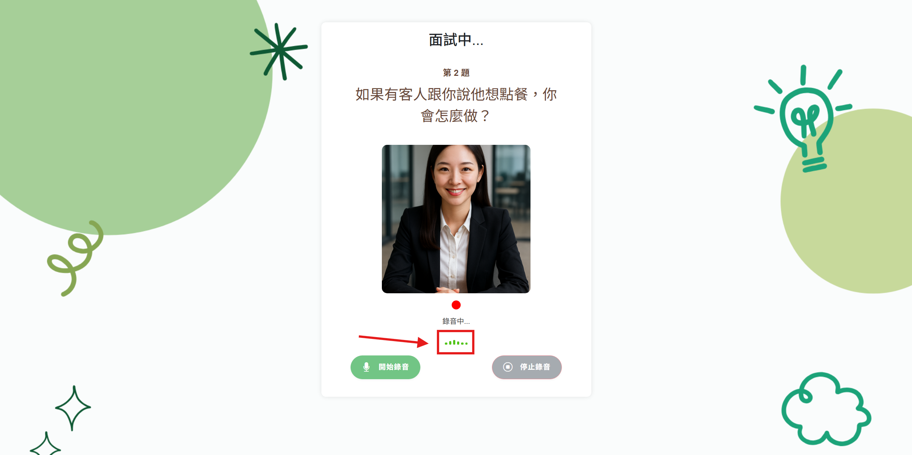
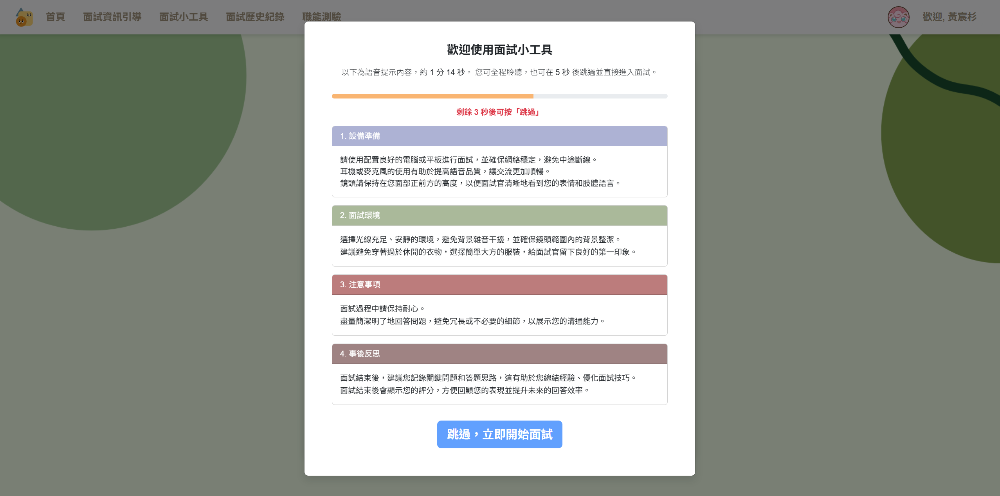
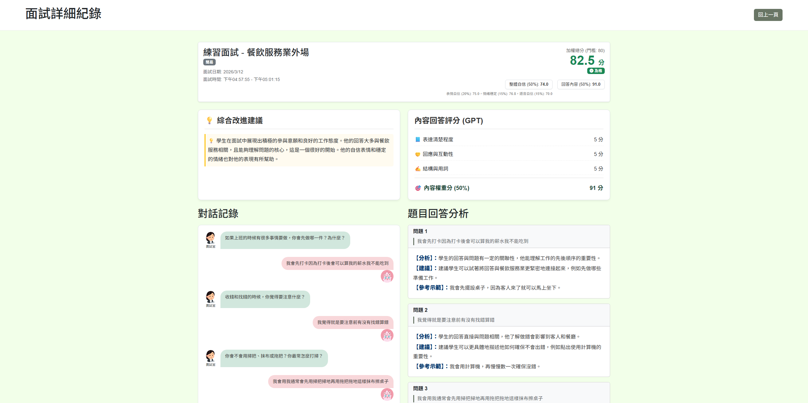
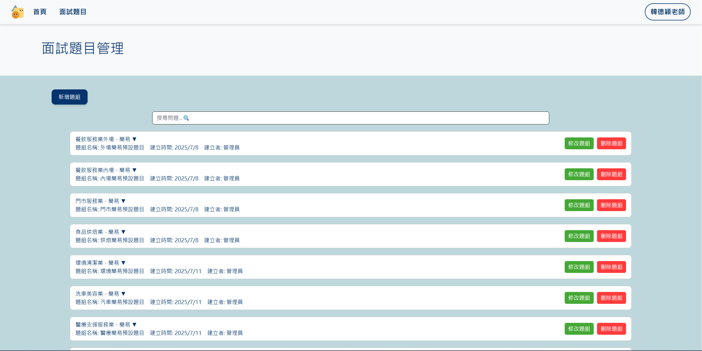

# 輕度智能障礙學員面試訓練系統 — Showcase

> 這是 **輕度智能障礙學員面試訓練系統**的公開展示倉庫，提供架構說明、功能截圖與代表性程式碼片段。  
> 本專案為**國科會計畫**成果，完整原始碼不公開。

🌐 **Live Demo：[ice-interview.com/](https://ice-interview.com/)**

---

## 專案概要

為**輕度智能障礙學生**打造的 AI 模擬面試練習平台。學生可依目標職位進行反覆練習，系統即時分析表情與語音並在面試結束後生成個人化回饋報告，幫助他們建立信心、降低進入職場的門檻。

與**台灣師範大學研究團隊**合作，經申請**國科會計畫**（NSTC 114-2410-H-003-025-MY2）支持後正式上線，目前仍持續服務中。

📄 **相關學術發表**：[Developing a Generative AI Interview Skills Training System for Individuals with Disabilities](https://dl.acm.org/doi/10.1145/3761843.3761923)
— Wu et al.，ACM ICEMT 2025，大阪，日本
（本系統列於論文致謝）

---

## 說明（分工與本 README 範圍）

本專案開發期間為 **五人小組**。

其餘成員之細部分工因早期紀錄不完整，**本 README 僅記載本人（Kinomoo）主要貢獻**，不代表完整團隊分工。完整原始碼未公開，本倉庫僅提供架構說明與代表性程式片段，詳見 [`SECURITY-NOTICE.md`](./SECURITY-NOTICE.md)。

### 本人負責範圍（Kinomoo）— 後端／DevOps

- **學生端初版核心邏輯**：早期版本之 **AI 題目生成**、**面試報告生成** 流程與 **OpenAI API 串接**（後續功能與介面歷經多輪擴充與調整）。
- **專案重構（獨立完成）**：將舊版分散、難以協作的結構，整理為可維護的 **pnpm monorepo（Express + TypeScript）** 與模組化後端，並導入 **Prisma／MySQL** 等現行架構基礎。
- **部署與維運（獨力完成）**：從本機開發環境到可對外服務之上線流程；舊版時期首次導入 **Nginx 反向代理與路徑分流**、處理本機與站內路徑混亂問題；現行環境以 **GCP + Nginx** 為主，**Docker 主要用於 MySQL**。
- **協作流程建立**：將專案正式上架 **GitHub**、建立分支／合併與協作節奏，改善多人開發混亂狀況。
- **管理端 Prompt 測試工具**：提供 Prompt 與素材抽題之測試與驗證流程，用於對齊學生端高難度出題邏輯。

---

## 核心功能

**🎙️ AI 模擬面試**
- 依目標職位與難度自動生成面試題（雙軌出題：素材庫 + GPT-4o 追問）
- 即時透過攝影機分析表情，透過麥克風偵測語音狀態
- 面試結束後由 GPT-4o 生成個人化表現報告

**📊 即時分析**
- 表情自信分（FER + MTCNN 偵測，每 500ms 一幀）
- 情緒穩定分（valence 標準差）
- 聲音大小視覺化 bar（即時提示學生音量狀態）

**📋 職能測驗**
- DISC 人格測驗，生成職業傾向分析報告
- 歷史結果保存，追蹤能力發展進程

**📁 面試歷史紀錄**
- 自動保存每次面試完整紀錄
- 支援跨時間段比較，量化進步幅度

**🖥️ 教師後台**
- 學生帳號管理（支援 Excel 批次匯入）
- 題庫 / 題組管理，可指定特定班級使用的題組
- 查看任一學生的面試紀錄與報告

---

## 技術棧

| 層級 | 技術 |
|------|------|
| 後端 | Express · TypeScript · pnpm monorepo |
| 資料庫 | MySQL 8.0 · Prisma ORM |
| 即時通訊 | Socket.IO |
| AI 出題 / 報告 | OpenAI GPT-4o |
| 表情分析 | Python · FER (MTCNN) · OpenCV |
| 語音辨識 | Web Speech API（瀏覽器端） |
| 語音合成 | Google Cloud Text-to-Speech |
| 前端 | HTML · JavaScript · Bootstrap · TailwindCSS |
| 部署 | GCP · Nginx · Docker (MySQL) |

詳細架構請見 [`ARCHITECTURE.md`](./ARCHITECTURE.md)

---

## 截圖

### 面試進行中（含聲音偵測 bar）

### 面試前倒數 + 朗讀須知

### 面試表現報告

### 教師後台

---

## Demo 影片

🎬 **[觀看 Demo 影片](https://youtu.be/pU0o4olIkgU?si=Wod_7hqlRSF_hLU-)**

> 此影片為 2024 年 11 月專題競賽提交版本，系統目前功能已大幅擴充。

---

## 程式碼片段

| 檔案 | 說明 |
|------|------|
| [`snippets/ai-question-gen.ts`](./snippets/ai-question-gen.ts) | 雙軌出題邏輯（RAG 素材 + GPT-4o 追問） |
| [`snippets/emotion-analysis-pipeline.ts`](./snippets/emotion-analysis-pipeline.ts) | Node.js ↔ Python 即時分析 Pipeline |
| [`snippets/emotion-analysis-core.py`](./snippets/emotion-analysis-core.py) | FER 表情偵測與信心分數計算 |
| [`snippets/report-generate.ts`](./snippets/report-generate.ts) | GPT-4o 報告生成與加權分數計算 |

---

## 原始碼政策

本倉庫為國科會計畫成果，依計畫規範不公開完整原始碼，且不含任何憑證、金鑰或可重建完整服務的關鍵程式碼。
詳見 [`SECURITY-NOTICE.md`](./SECURITY-NOTICE.md)。
